# Deepak M Raigonda — Portfolio Website

Welcome to my personal portfolio website!  
This site represents my journey as a **Computer Science & Engineering undergraduate**, showcasing my skills, projects, and passion for building impactful software systems.

🔗 **Live Website:**  
👉 https://deepakmraigonda.github.io/

---

## ✨ Highlights

🚀 **Modern, interactive portfolio** designed with performance and clarity in mind  
🎨 **Glassmorphism UI** with neon accents and smooth animations  
🧠 **Project-focused storytelling** instead of generic resumes  
⚡ **Optimized for GitHub Pages deployment**

---

## 🖥️ Tech Stack

### Frontend
- **HTML5** – Semantic & accessible structure  
- **CSS3** – Custom design system, animations & responsiveness  
- **JavaScript (Vanilla)** – Interactivity & dynamic behavior  

### Visual & UX Enhancements
- **Particles.js** – Interactive animated background  
- **Glassmorphism UI** – Frosted cards & neon glow effects  
- **Smooth Scroll & Hover Effects** – Polished user experience  

### Tooling & Deployment
- **Git & GitHub** – Version control  
- **GitHub Pages** – Live hosting  

---

## Key Features

- 🎯 **Hero Section with Live Particle Background**
- 🧊 **Glassmorphic Cards** with neon hover glow
- 🧠 **Well-structured About Me** with clear intent & direction
- 📄 **Resume Section** with downloadable CV
- 🧰 **Skill Grid** organized by domain
- 🔗 **Social & Contact Links** with interactive icons
- 📱 **Responsive Design**
- ⚙️ **Clean, modular CSS architecture**

---

## 📂 Project Structure

## 🔄 Website Flow & Structure

```mermaid
flowchart TD
    A[User Opens Website] --> B[index.html]

    B --> C[Global Layout & Styles]
    C --> C1[css/style.css]
    C --> C2[Google Fonts]
    C --> C3[Theme Variables]

    B --> D[Hero Section]
    D --> D1[Name & Tagline]
    D --> D2[Short Introduction]
    D --> D3[Social Links]

    B --> E[Particles Background]
    E --> E1[particles.js]
    E --> E2[Mouse Interaction]

    B --> F[About Section]
    F --> F1[What I Do]
    F --> F2[How I Think]
    F --> F3[Career Direction]

    B --> G[Resume Section]
    G --> G1[Summary]
    G --> G2[Skills Overview]
    G --> G3[Projects]
    G --> G4[Education]
    G --> G5[Download CV]

    B --> H[Skills Section]
    H --> H1[Programming]
    H --> H2[Web Development]
    H --> H3[Databases]
    H --> H4[Tools & CS Concepts]

    B --> I[Contact Section]
    I --> I1[Email]
    I --> I2[LinkedIn]
    I --> I3[GitHub]
    I --> I4[Resume]
    I --> I5[Instagram]

    B --> J[JavaScript Logic]
    J --> J1[Scroll Effects]
    J --> J2[Profile Image Shrink]
    J --> J3[Go To Top Button]
```

--- 

## 🎯 Design Philosophy

> “Good software balances functionality, usability, and maintainability.”

This portfolio focuses on:
- **Clarity over clutter**
- **Subtle motion over flashy effects**
- **Real projects over buzzwords**
- **Scalable structure over shortcuts**
 

---

## 📌 Future Improvements

- 🌙 Dark / Light mode toggle  
- 🧩 Project detail pages  
- 📊 GitHub API integration for live stats  
- 🧠 Blog / Notes section  
- 🎥 Motion-enhanced micro-interactions  

---

## 📬 Contact

- 📧 **Email:** deepakmraigonda@gmail.com  
- 💼 **LinkedIn:** https://www.linkedin.com/in/deepakmraigonda  
- 🐙 **GitHub:** https://github.com/deepakmraigonda  

---

##  Acknowledgements

Built from scratch with curiosity, late nights, and a lot of debugging ☕  
Designed & developed by **Deepak M Raigonda**.

---

⭐ liked the project?, consider giving the repo a star!
